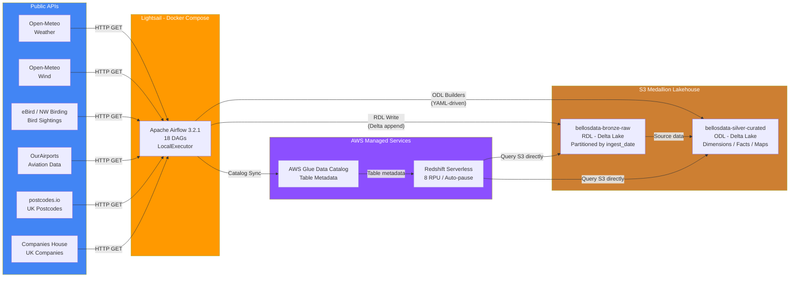
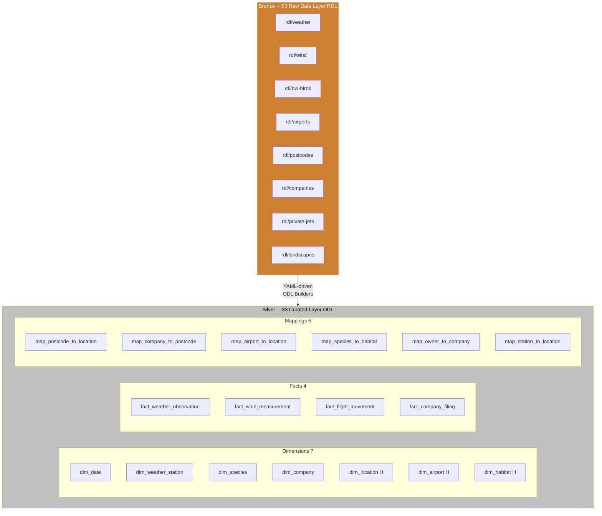
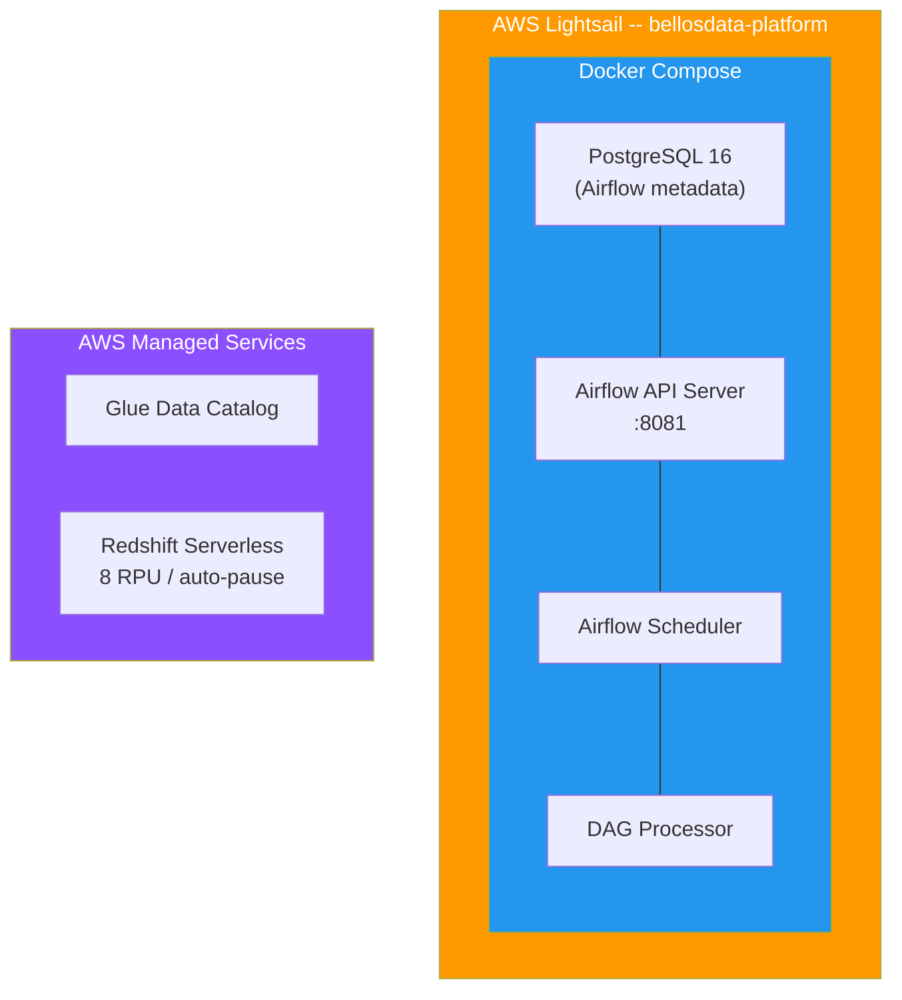

<p align="center">
  <h1 align="center">BellosData Lakehouse - S3 Delta Lake Platform</h1>
  <p align="center">
    <strong>AWS-native data lakehouse — public APIs ingested by Airflow, stored as Delta Lake on S3, modelled via YAML-driven dimensional builders, catalogued by AWS Glue, and queried with Redshift Serverless.</strong>
  </p>
  <p align="center">
    
    
    
    
    
    
    
    
    
  </p>
</p>

---

## Architecture Overview

A **production-grade data lakehouse** built entirely on AWS serverless/low-cost services. The platform ingests data from **6 public APIs**, stores it as **Delta Lake** tables on S3, transforms it through **YAML-driven dimensional builders**, catalogues metadata via **AWS Glue Data Catalog**, and serves analytics through **Redshift Serverless** (compute-only, no Spectrum fees).



### How It Works

1. **18 Airflow DAGs** run on a schedule -- each ingests data from a public API via HTTP
2. **RDL ingestion DAGs** write raw JSON records to **S3 Bronze** as Delta Lake tables, partitioned by `ingest_date`
3. **ODL builder DAGs** read YAML configuration files (`dimensions.yml`, `facts.yml`, `mappings.yml`) and construct typed dimensional tables on **S3 Silver**
4. **Glue Catalog Sync DAG** registers all Delta tables in **AWS Glue Data Catalog** for metadata governance
5. **Redshift Serverless** queries S3 Delta Lake directly via external schemas -- no Spectrum fees, auto-pauses when idle

---

## Tech Stack

| Layer | Technology | Purpose |
|-------|-----------|---------|
| **Infrastructure** | Terraform | Lightsail, ECR, ECS, Lambda, API Gateway, Glue, Redshift -- all as code |
| **Compute** | AWS Lightsail | Always-on `medium_3_0` (4 GB RAM, 2 vCPU, $24/mo) |
| **Orchestration** | Apache Airflow 3.2.1 | LocalExecutor with PostgreSQL, 18 DAGs |
| **Containerisation** | Docker Compose | Airflow cluster (4 containers) |
| **Storage** | Amazon S3 | Two-tier Delta Lake: Bronze (`bellosdata-bronze-raw`) + Silver (`bellosdata-silver-curated`) |
| **Table Format** | Delta Lake | ACID transactions, time travel, schema enforcement |
| **Catalog** | AWS Glue Data Catalog | Managed metadata governance, Hive Metastore-compatible |
| **Query Engine** | Redshift Serverless | Compute-only, 8 RPU, auto-pause, queries S3 natively (no Spectrum fees) |
| **Language** | Python 3.11 | All DAGs, builders, and utilities |

---

## Project Structure

```
bellosdata-lakehouse/
|
+-- airflow/
|   +-- dags/                              # 18 orchestration DAGs
|   |   +-- bellosdata_common.py           # Shared: rdl_write, odl_write, http_get, manifests
|   |   +-- aws_session.py                 # AWS credential management
|   |   |
|   |   +-- rdl_weather_ingestion.py       # Open-Meteo > NW England hourly weather
|   |   +-- rdl_wind_ingestion.py          # Open-Meteo > Multi-height wind data
|   |   +-- nw_bird_ingestion.py           # eBird + NW Birding > Bird sightings
|   |   +-- rdl_airports_ingestion.py      # OurAirports > Global airport data
|   |   +-- rdl_postcodes_ingestion.py     # postcodes.io > UK postcode lookup
|   |   +-- rdl_companies_enhanced.py      # Companies House > NW companies
|   |   +-- rdl_landscapes_ingestion.py    # UK landscape/habitat data
|   |   +-- private_jet_ingestion.py       # OpenSky > NW private jet movements
|   |   |
|   |   +-- odl_dim_builder.py             # YAML-driven dimension builder
|   |   +-- odl_fact_builder.py            # YAML-driven fact table builder
|   |   +-- odl_mapping_builder.py         # YAML-driven mapping table builder
|   |   |
|   |   +-- companies_house_upload_dag.py  # Companies House S3 upload
|   |   +-- drive_sync_dag.py              # Google Drive sync
|   |   +-- budget_monitor_dag.py          # AWS cost monitoring
|   |   +-- invoice_engine.py              # Invoice generation
|   |   +-- receipt_archive_dag.py         # Receipt archival to S3
|   |
|   +-- config/                            # YAML-driven data model registry
|   |   +-- dimensions.yml                 # 7 dimensions (flat + hierarchy)
|   |   +-- facts.yml                      # 4 fact tables with measures
|   |   +-- mappings.yml                   # 6 mapping/bridge tables
|   |   +-- copy_jobs.yml                  # S3 copy job definitions
|   |   +-- export_jobs.yml                # Data export configs
|   |
|   +-- plugins/                           # Airflow custom plugins
|   +-- docker-compose.yaml                # Full Airflow cluster (CeleryExecutor)
|   +-- docker-compose.cloud.yaml          # Cloud-optimised compose (LocalExecutor)
|
+-- terraform/
|   +-- main.tf                            # Lightsail + ECR + ECS + Lambda API + API Gateway
|
+-- unity-catalog/
|   +-- compose.yaml                       # Unity Catalog local compose
|   +-- compose.cloud.yaml                 # Unity Catalog cloud compose
|   +-- etc/conf/                          # Unity Catalog server config
|
+-- lambda/
|   +-- ledger_api.py                      # Serverless cloud API (always-on Lambda)
|
+-- .github/
|   +-- workflows/
|       +-- pr_title_checker.yml           # Enforces DATA-X branch naming
|
+-- deploy-cloud.sh                        # Cloud deployment script (SCP + SSH)
+-- deploy-platform.ps1                    # Windows deployment automation
+-- start-platform.ps1                     # Local platform startup
|
+-- .gitignore
+-- README.md
```

---

## Data Domains

The lakehouse ingests data across **6 domains**, all from free public APIs:

| Domain | Source API | Schedule | Key Data |
|--------|-----------|----------|----------|
| **Weather** | Open-Meteo | Daily 08:00 UTC | Hourly observations for 8 NW England grid points -- temp, precipitation, wind, UV |
| **Wind** | Open-Meteo | Daily 08:30 UTC | Multi-height wind (10m/80m/120m) for energy and aviation analysis |
| **NW Birds** | eBird + NW Birding | Daily 09:00 UTC | Bird sightings, species taxonomy, conservation status |
| **Airports** | OurAirports CSV | Weekly | Global airport database -- runways, coordinates, ICAO/IATA codes |
| **Postcodes** | postcodes.io | Weekly | Full UK postcode register -- geography, IMD, LSOA, constituency |
| **Companies** | Companies House API | Daily | NW England company register -- filings, SIC codes, insolvency |
| **Private Jets** | OpenSky Network | Hourly | ADS-B aircraft positions over NW England airspace |
| **Landscapes** | Multiple open sources | Monthly | UK habitat and landscape classification -- SSSIs, NNRs, AONBs |

---

## Medallion Architecture

The lakehouse follows a **Bronze > Silver** medallion pattern with YAML-driven transformation:



> **H** = Hierarchy dimension (multi-level parent-child: e.g. `dim_location` = Country > Region > County > District > Ward > Postcode)

| Layer | S3 Bucket | Format | Purpose |
|-------|-----------|--------|---------|
| **Bronze (RDL)** | `bellosdata-bronze-raw` | Delta Lake (append) | Raw JSON records, partitioned by `ingest_date`. Source of truth. |
| **Silver (ODL)** | `bellosdata-silver-curated` | Delta Lake (overwrite) | Typed star schema -- dimensions, facts, mappings. Surrogate keys. |

---

## YAML-Driven Data Modelling

Instead of hand-coding SQL transformations, the lakehouse uses **3 YAML registries** that are read by Python builder DAGs:

| Registry | File | Drives | Contents |
|----------|------|--------|----------|
| **Dimensions** | `config/dimensions.yml` | `odl_dim_builder.py` | 7 dimensions -- flat (SCD1/2) and hierarchy (multi-level parent-child) |
| **Facts** | `config/facts.yml` | `odl_fact_builder.py` | 4 fact tables -- grain, dimension keys, measures with aggregation types |
| **Mappings** | `config/mappings.yml` | `odl_mapping_builder.py` | 6 bridge tables -- one-to-one, many-to-one, many-to-many with fuzzy matching |

### Example: Adding a new dimension

```yaml
# dimensions.yml -- just add a new entry:
- name: dim_my_new_entity
  type: flat
  source: rdl/my_source
  scd_type: 2
  grain: "One row per entity"
  business_key: [entity_id]
  attributes:
    - name: entity_sk
      dtype: int32
      description: "Surrogate key"
    - name: entity_id
      dtype: string
```

The `odl_dim_builder` DAG will automatically detect the new entry and create the corresponding Delta table on Silver S3.

---

## Airflow DAGs

**18 DAGs** running on Airflow 3.2.1 with CeleryExecutor:

| DAG | Schedule | Category | Purpose |
|-----|----------|----------|---------|
| `rdl_weather_ingestion` | `0 8 * * *` | RDL | Open-Meteo > 8 NW grid points hourly weather |
| `rdl_wind_ingestion` | `0 8 30 * * *` | RDL | Open-Meteo > Multi-height wind data |
| `nw_bird_ingestion` | `0 9 * * *` | RDL | eBird + NW Birding > Bird sightings |
| `rdl_airports_ingestion` | `0 6 * * 1` | RDL | OurAirports CSV > Global airport data |
| `rdl_postcodes_ingestion` | `0 7 * * 1` | RDL | postcodes.io > Full UK postcode register |
| `rdl_companies_enhanced` | `0 10 * * *` | RDL | Companies House API > NW company register |
| `rdl_landscapes_ingestion` | `0 6 1 * *` | RDL | UK landscapes + habitats |
| `private_jet_ingestion` | `0 * * * *` | RDL | OpenSky > NW airspace ADS-B positions |
| `odl_dim_builder` | Asset-triggered | ODL | YAML-driven dimension table builder |
| `odl_fact_builder` | Asset-triggered | ODL | YAML-driven fact table builder |
| `odl_mapping_builder` | Asset-triggered | ODL | YAML-driven mapping table builder |
| `companies_house_upload` | Manual | Utility | Bulk Companies House CSV upload |
| `drive_sync_dag` | `0 2 * * *` | Utility | Google Drive file sync |
| `budget_monitor_dag` | `0 9 * * 1` | Ops | AWS Cost Explorer monitoring |
| `invoice_engine` | Manual | Business | Invoice generation pipeline |
| `receipt_archive_dag` | `0 3 * * *` | Ops | Receipt archival to S3 |

> **Asset-triggered** DAGs use Airflow's Asset-based scheduling -- they automatically run when upstream RDL DAGs publish new data.

---

## Infrastructure

### Lightsail + Docker Compose

Airflow orchestration runs on a single **AWS Lightsail** instance via Docker Compose. Catalog and query are **managed AWS services**:



| Component | Details |
|-----------|---------|
| **Instance** | Lightsail `medium_3_0` -- 4 GB RAM, 2 vCPU, 80 GB SSD |
| **OS** | Amazon Linux 2023 |
| **Static IP** | Elastic IP attached for persistent access |
| **Ports** | 8081 (Airflow UI) |
| **Docker services** | 4 containers: PostgreSQL, API Server, Scheduler, DAG Processor |

### Terraform Resources

| Resource | Description |
|----------|-------------|
| `aws_lightsail_instance` | Data platform instance with Docker bootstrap |
| `aws_lightsail_static_ip` | Persistent IP for Airflow access |
| `aws_glue_catalog_database` | `bellosdata` -- lakehouse metadata catalog |
| `aws_redshiftserverless_namespace` | `bellosdata` -- Redshift database + admin credentials |
| `aws_redshiftserverless_workgroup` | `bellosdata-workgroup` -- 8 RPU compute, auto-pause |
| `aws_iam_role` | Redshift → S3 + Glue access role |
| `aws_ecr_repository` | Container registry for pipeline images |
| `aws_ecs_cluster` + `task_definition` | Fargate-ready for future container workloads |
| `aws_apigatewayv2_api` | HTTP API Gateway for serverless Lambda API |
| `aws_lambda_function` | `ledger-cloud-api` -- always-on serverless endpoint |

---

## Cost Estimate

| Service | Monthly | Notes |
|---------|---------|-------|
| Lightsail | $24.00 | Always-on 4 GB instance |
| Redshift Serverless | ~$3-6 | 8 RPU, auto-pause after 5 min, ~2h/mo query time |
| S3 (Bronze + Silver) | ~$0.05 | < 500 MB Delta Lake tables |
| Glue Data Catalog | $0.00 | Free Tier (first 1M objects) |
| Lambda (API) | $0.00 | Free Tier |
| API Gateway | $0.00 | Free Tier |
| ECR | $0.00 | Free Tier storage |
| **Total** | **~$27-30/month** | |

---

## Quick Start

```bash
# Clone
git clone https://github.com/TimiOlayinka/bellosdata-lakehouse.git
cd bellosdata-lakehouse

# Create .env (AWS credentials for S3 access)
cat > airflow/.env <<EOF
AWS_ACCESS_KEY_ID=your_key
AWS_SECRET_ACCESS_KEY=your_secret
AWS_DEFAULT_REGION=eu-west-2
EOF

# Start the platform locally
cd airflow
docker compose up -d

# Access services
# Airflow UI:        http://localhost:8081
# Glue Catalog:      AWS Console > Glue > Databases > bellosdata
# Redshift Query:    AWS Console > Redshift Query Editor v2

# Deploy to cloud (Lightsail)
cd .. && pwsh deploy-platform.ps1
```

---

**Built by [Timi Olayinka](https://github.com/TimiOlayinka)** -- Data Engineering and AI Automation
